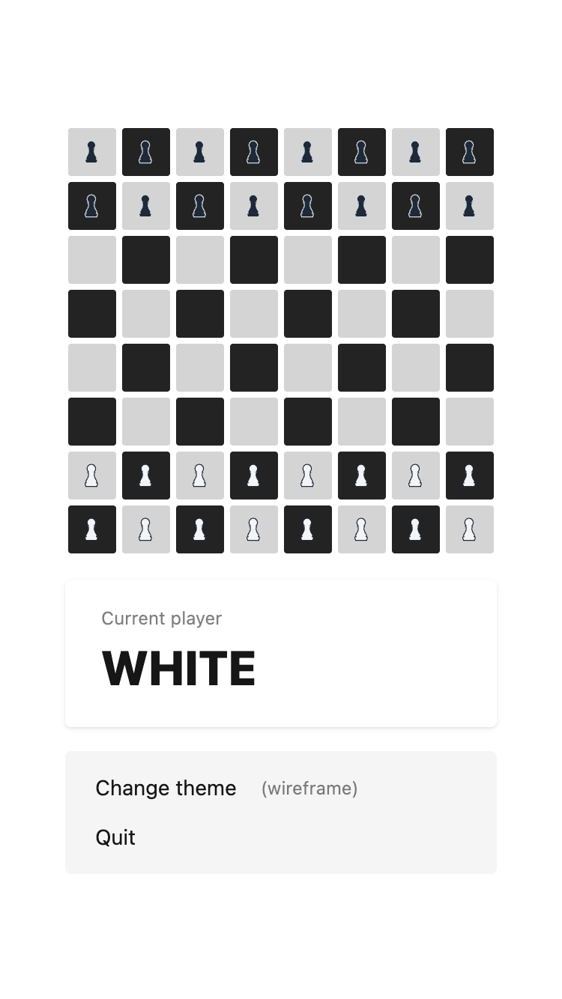

# React Breakthrough

A React 19 + TypeScript + Vite implementation of the board game "Breakthrough". Built with Tailwind CSS and organized using Atomic Design patterns.

## Screenshot

<p align="center">
  
</p>

<p align="center">
  <em>The game features an 8x8 board with drag-and-drop pieces, current player indicator, and theme customization.</em>
</p>

## About Breakthrough

Breakthrough is a two-player abstract strategy board game where each player starts with pawns on opposite sides of the board. The objective is to be the first player to reach the opponent's home row (the first row on the opponent's side).

### Game Rules

- **Movement**: Pawns can move one square forward or diagonally forward
- **Capturing**: Pawns capture by moving diagonally forward onto an opponent's piece
- **Winning**: The first player to reach their opponent's home row wins
- **Turn-based**: Players alternate turns, with white moving first

## Prerequisites

- Node.js 18+
- npm or pnpm

## Getting Started

### 1. Install Dependencies

```bash
npm install
# or
pnpm install
```

### 2. Start Development Server

```bash
npm run dev
```

This starts the Vite dev server with hot module reloading (HMR). Open the URL shown in your terminal (typically `http://localhost:5173`) in your browser.

### 3. Build for Production

```bash
npm run build
```

Compiles TypeScript and creates an optimized production build in the `/dist` directory.

### 4. Preview Production Build

```bash
npm run preview
```

Serves the production build locally for testing before deployment.

### 5. Run Linting

```bash
npm run lint
```

Runs ESLint checks on your code for TypeScript and style issues.

## Features

- **Start Page**: Choose between default 8x8 board or custom dimensions
- **Custom Board Options**: Create boards from 4x4 to 26x26 with real-time validation
- **Drag & Drop Gameplay**: Smooth piece movement using @dnd-kit library
- **Visual Themes**: Multiple board themes including wireframe, classic, and more
- **Theme Selector**: Easy-to-use modal for switching between visual themes
- **Current Player Indicator**: Clear display of whose turn it is
- **Game Over Detection**: Automatic win detection when a piece reaches the opponent's home row
- **Quit Functionality**: Option to quit and return to the start page
- **State Management**: React Context + useReducer for game state
- **Responsive Design**: Mobile and desktop support with Tailwind CSS + DaisyUI

## Tech Stack

- **React 19.1.1** - UI framework
- **TypeScript ~5.9.3** - Type safety
- **Vite 7.1.7** - Build tool and dev server
- **Tailwind CSS 4.1.14** - Utility-first styling
- **@dnd-kit** - Drag and drop functionality
- **TypeScript ESLint 8.45.0** - Linting

## Project Structure

```
src/
├── components/
│   ├── atoms/          - Basic UI elements
│   │   ├── gamePiece.tsx      - Individual draggable game pieces
│   │   └── gameSquare.tsx     - Board squares with drag-and-drop
│   ├── molecules/      - Composite components
│   │   ├── gameBoard.tsx      - Main game board
│   │   ├── gameMenu.tsx       - In-game menu for reset & custom dimensions
│   │   ├── gameOverModal.tsx  - Victory screen modal
│   │   └── themeSelector.tsx  - Theme selection modal
│   └── pages/
│       └── startPage.tsx      - Initial screen with game mode selection
├── contexts/
│   ├── boardStateContext.ts   - Context definition and useBoardState hook
│   └── boardStateProvider.tsx - Reducer provider for game state
├── hooks/
│   └── useGameMechanic.ts     - Game logic (moves, win conditions, validation)
├── utils/
│   ├── types.ts               - TypeScript type definitions
│   ├── constants.ts           - Game constants
│   └── boardStateUtils.ts     - Board generation & piece movement utilities
└── App.tsx                    - Root component
```

## How to Play

1. **Start a Game**: Choose "Start Game" for default 8x8 board or "Custom Dimensions" for a custom size
2. **Move Pieces**: Drag and drop your pieces to valid squares (one square forward or diagonally forward)
3. **Capture**: Move diagonally forward onto an opponent's piece to capture it
4. **Win**: Be the first to reach your opponent's home row
5. **Customize**: Click "Change theme" to switch between visual themes
6. **Quit**: Use the "Quit" button to return to the start page

## License

MIT
